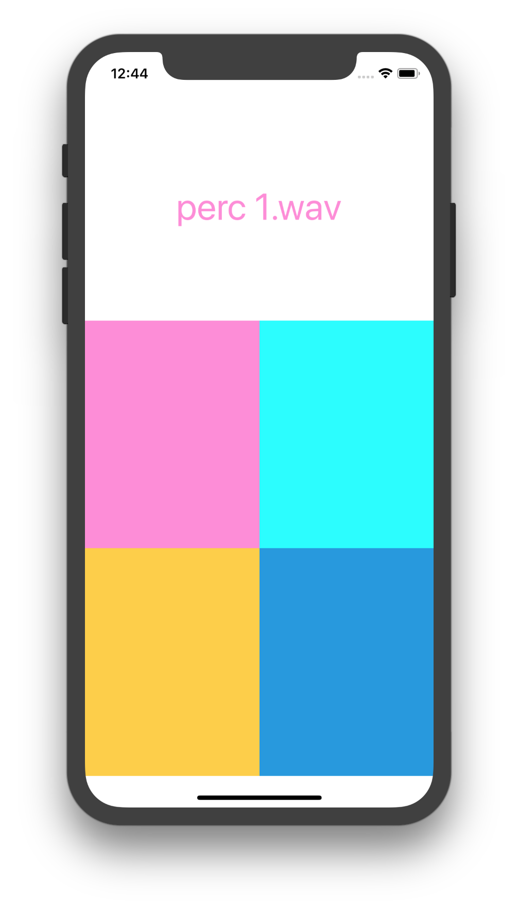

# SoundBoard
### iOS Club
### Spring 2018, 1/16/2018

4 UIButtons, each with an IBAction, and 1 UILabel with an IBOutlet

### Challenges
1. Have 9 buttons, using an IBOutletCollection
2. Find a way to reduce duplicated code 
3. Play multiple sounds at once (currently only one at a time)
4. Play the same sound rapidly
